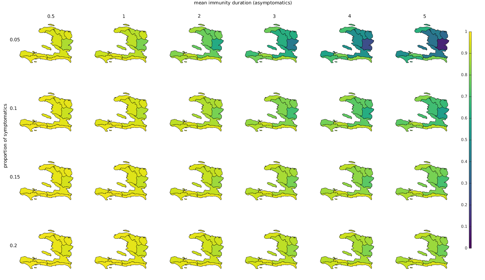

# Estimation of the percentage of population susceptible

The matlab code "run.m" estimates the percentage of people susceptible to cholera (as opposed to immune) in each Haitian department based on the case data published by the Ministry of Health (MSPP) between October 2010 and September 2016. Port-au-Prince is considered separate from Ouest and consists of the communes 'Carrefour', 'Cite Soleil','Delmas','Kenscoff','Petion-Ville','Port-au-Prince','Tabarre'.

The code could easily be adapted to smaller administrative units if the case data for those units was available.

For a description of the data and the equations used see below.

In the context of this analysis, an asymptomatic person is defined as a person having cholera but symptoms are not severe enough that they get reported. In addition, this also includes under-reporting.

## Scenario 1: ignore asymptomatics
Only symptomatically infected are assumed to acquire immunity. The spatial distribution of susceptibles at the end of September 2016 is explored depending on the mean immunity duration for symptomatically infected. The color in the figure below shows the proportion of susceptibles in the entire population.

## Scenario 2: symptomatics and asymptomatics have the same immunity duration

The figure shows the estimated proportion of susceptibles in each department (and Port-au-Prince) on the 25th September 2016 depending on the mean duration of acquired immunity (x-direction, in years) and the proportion of symptomatic (and thus reported) infections (y-direction). According to this estimate, significant proportions of immune people can only be present in certain areas of Haiti if the mean duration of immunity is quite high and if the proportion of symptomatically infected is low (e.g. many non-reported asymptomatic cases present who still acquired immunity). **Note that for those estimates a key assumption is that the average immunity duration for asymptomatics is as long as for symptomatics**.

## Scenario 3: asymptomatics have a different immunity duration than symptomatics

In this scenario, the mean **immunity duration for symptomatically infected is set to 4 years**, and the proportion of susceptibles in each department is explored as a function of the mean immunity duration of asymptomatically infected (x-axis) and the proportion of symptomatic (and thus reported) infections over total infections (y-direction).

## Data
Case data has been downloaded from the MSPP website over the years and extracted from the pdf files. The data consists of number of newly reported cases ("cas vus") per day.

## Population
The population per department has been taken from the PAHO website (http://ais.paho.org/phip/viz/ed_haiticoleracases.asp) on 21.10.2016. The source of the data is "Data source: Direction des Statistiques Démographiques et Sociales (DSDS), Institut Haïtien de Statistique et d'Informatique (IHSI), mars 2015 http://www.ihsi.ht/produit_demo_soc.htm"

## Equations
The set of equations have been modified from [Bertuzzo et al (2014)](http://link.springer.com/article/10.1007/s00477-014-0906-3). It is assumed that the reported cases in every department correspond to the newly infected . The system of equations can thus be reduced to one for the number of infected and one for the number of recovered, the number of susceptibles can be computed using the estimates of the total population:

Parameters ,  and  have been taken from the same study.

The average duration of acquired immunity  and the proportion of infections leading to symptoms  are unknown and have to be explored.

For Scenario 3, a set of equation with a separate category for asymptomatic recovered has been used. This allows to have a different immunity duration  for asymptomatics.

